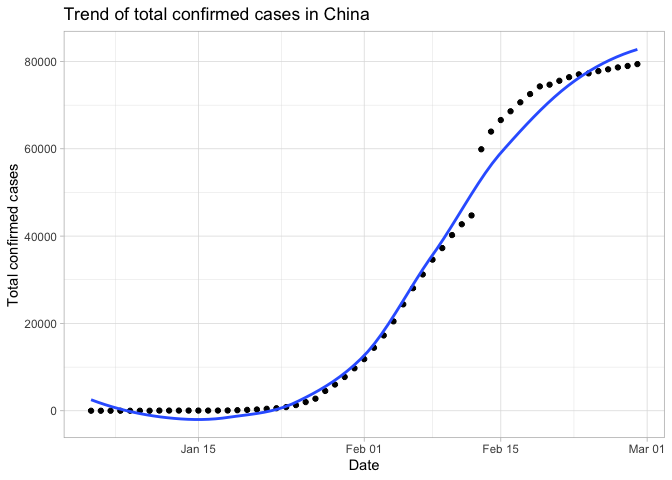

<!-- README.md is generated from README.Rmd. Please edit that file -->

# zeyushiny

<!-- badges: start -->

<!-- badges: end -->

The goal of zeyushiny is to embed my shiny application and make it lunch
via `launch_app()` function exported by my package.

## Installation

You can install the development version from
[GitHub](https://github.com/etc5523-2020/r-package-assessment-zyliu178.git)
with:

``` r
# install.packages("devtools")
devtools::install_github("etc5523-2020/r-package-assessment-zyliu178")
```

## Example

Trend of total confirmed cases in China

``` r
library(zeyushiny)
# Load shiny application
launch_app()
```

``` r
library(tidyverse)
library(zeyushiny)
cov_total %>% filter(month <=2) %>%
  ggplot(aes(x = Date_reported, y = Cumulative_cases)) + 
            geom_point() +
            geom_smooth(se = FALSE) +
            theme(legend.title = element_blank()) +
            xlab("Date") +
            theme_light() +
            ylab("Total confirmed cases") +
            theme(legend.position = "none") +
            ggtitle("Trend of total confirmed cases in China")
```


